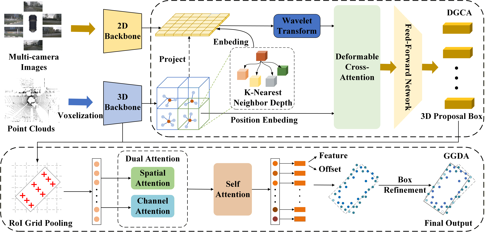

# DGMFusion
Important Notice: This repository contains the official implementation of the manuscript "Depth-Guided Multimodal Fusion with Semantic Enhancement and Local-to-Global Geometric Refinement for 3D Object Detection". 

## Framework



## Project Structure
  ```
  detection
  ├── al3d_det
  │   ├── datasets
  │   │   │── DatasetTemplate: the basic class for constructing dataset
  │   │   │── augmentor: different augmentation during training or inference
  │   │   │── processor: processing points into voxel space
  │   │   │── the specific dataset module
  │   ├── models: detection model related modules
  |   |   │── fusion: point cloud and image fusion modules
  │   │   │── image_modules: processing images
  │   │   │── modules: point cloud detector
  │   │   │── ops
  │   ├── utils: the exclusive utils used in detection module
  ├── tools
  │   ├── cfgs
  │   │   │── det_dataset_cfgs
  │   │   │── det_model_cfgs
  │   ├── train/test/visualize scripts  
  ├── data: the path of raw data of different dataset
  ├── output: the path of trained model
  al3d_utils: the shared utils used in every algorithm modules
  docs: the readme docs for DGMFusion
  ```


## Running
💥 This project relies heavily on `Ceph` storage. Please refer to your file storage system to modify the file path.
- Please cd the specific module and read the corresponding README for details
  - [Installation](docs/INSTALL.md)
  - [Data Preprocess](docs/DATA_PREPROCESS.md)
  - [Getting Started](docs/STARTED.md)

## Download Pre-trained Models
Please download the pre-trained model weights from the official sources:
<table>
    <thead>
        <tr>
            <th align="center">Model</th>
            <th align="center">Save Location</th>
        </tr>
    </thead>
    <tbody>
        <tr>
            <td align="left">KITTI</td>
            <td align="left"><code>detection/checkpoint/kitti folder [weights](https://www.alipan.com/s/WsoG45tHD2C)</code></td>
        </tr>
        <tr>
            <td align="left">DAIR-V2X-I</td>
            <td align="left"><code>detection/checkpoint/dair-v2x-i folder [weights](https://www.alipan.com/s/WsoG45tHD2C)</code></td>
        </tr>
        <tr>
            <td align="left">Waymo</td>
            <td align="left"><code>detection/checkpoint/waymo folder [weights](https://www.alipan.com/s/WsoG45tHD2C)</code></td>
        </tr>
    </tbody>
</table>

## Main results
*We report average metrics across all results on the KITTI dataset with mAP. We provide training / validation configurations, pretrained models for all models in the paper.
|  Model   | Car@40 | Ped@40 | Cyc@40
|  :----:  |  :----:  |  :----:  |:----:  |
| DGMFusion (val) | 86.97 | 62.67 | 80.41
| DGMFusion (test) | 85.71 | 48.29 | 77.77

*We report average metrics across all results on the DAIR-V2X-I with mAP. We provide training / validation configurations, pretrained models for all models in the paper. 
|  Model   | Car@40 | Ped@40 | Cyc@40
|  :----:  |  :----:  |  :----:  |:----:  |
|  DGMFusion (val) | 86.97 | 62.67 | 80.41

*We report average metrics across all results on the Waymo dataset with APH (L2). We provide training / validation configurations, pretrained models for all models in the paper. 
|  Model   | VEH_L2 | PED_L2 | CYC_L2 |
|  :-------:  |  :----:  |  :----:  |  :----:  |
| [DGMFusion-5frames (val)](detection/tools/cfgs/det_model_cfgs/waymo/DGMFusion-5f.yaml)  | 69.43/69.00 | 69.44/66.3 |59.43/58.83 

## Key Parameters
<table>
    <thead>
        <tr>
            <th align="center">Parameter</th>
            <th align="center">Recommended Value</th>
            <th align="center">Description</th>
        </tr>
    </thead>
    <tbody>
        <tr>
            <td align="left">epoch</td>
            <td align="center">80</td>
            <td align="left">total training epochs</td>
        </tr>
        <tr>
            <td align="left">lr</td>
            <td align="center">0.01</td>
            <td align="left">initial learning rate</td>
        </tr>
        <tr>
            <td align="left">k_graph</td>
            <td align="center">8</td>
            <td align="left">graph attention neighbors</td>
        </tr>
        <tr>
            <td align="left">n_heads</td>
            <td align="center">4</td>
            <td align="left">attention heads</td>
        </tr>
        <tr>
            <td align="left">wavelet</td>
            <td align="center">db8</td>
            <td align="left">wavelet type (daubechies 8)</td>
        </tr>
    </tbody>
</table>

## Acknowledgement
We sincerely appreciate the following open-source projects for providing valuable and high-quality codes: 
- [OpenPCDet](https://github.com/open-mmlab/OpenPCDet)
- [mmdetection3d](https://github.com/open-mmlab/mmdetection3d)
- [Focalsconv](https://github.com/dvlab-research/FocalsConv)
- [CenterPoint](https://github.com/tianweiy/CenterPoint)
- [BEVFusion(ADLab-AutoDrive)](https://github.com/ADLab-AutoDrive/BEVFusion)
- [BEVFusion(mit-han-lab)](https://github.com/mit-han-lab/bevfusion)
- [mmdetection](https://github.com/open-mmlab/mmdetection)
- [LoGoNet](https://github.com/PJLab-ADG/LoGoNet)
- [PDV](https://github.com/TRAILab/PDV)
- [GraphBEV](https://github.com/adept-thu/GraphBEV)

## Contact
- If you have any questions about this repo, please contact `nongliping@gxnu.edu.cn`.

